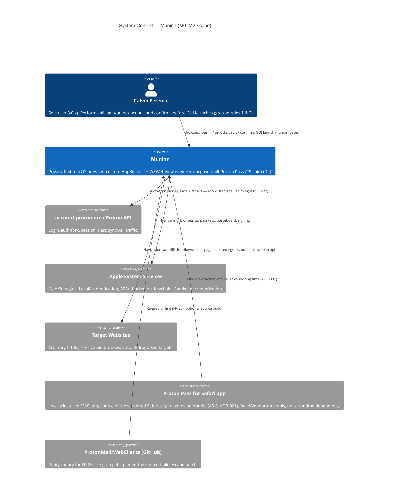
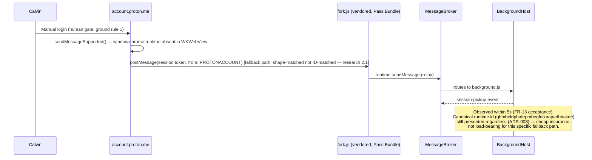
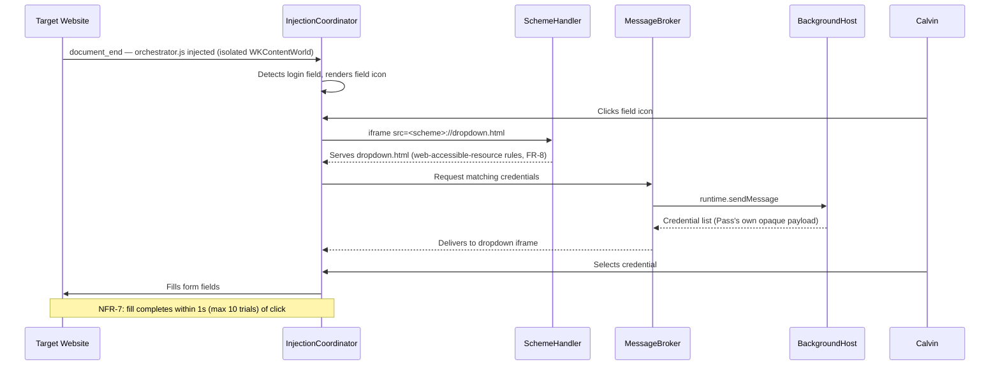
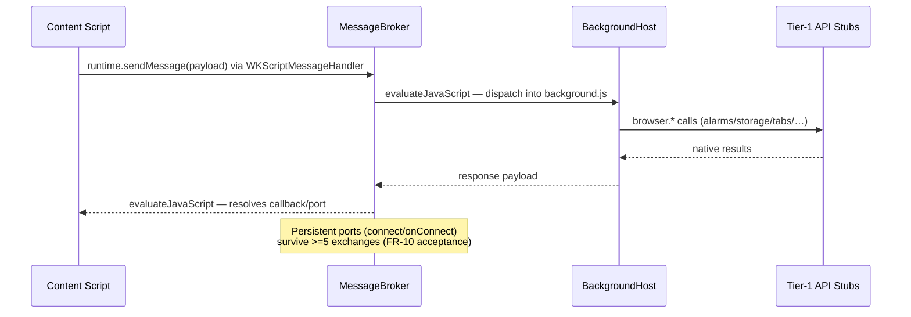

# Muninn — Architecture (HLD)

**Version:** 0.1
**Date:** 2026-07-11
**Status:** **APPROVED** — Calvin Ference, 2026-07-11 22:55 EDT (§10)
**Provenance:** Derived from `prd.md` (APPROVED v0.1, FR-1…29/NFR-1…10/§9 cutline), `roadmap.md` (APPROVED v0.1, M0–M3/E1–E12), `decisions.md` (D1–D4, locked), `research/spike-a-results.md`, `research/spike-b-proton-pass-api-inventory.md`, and `openspec/changes/architecture-and-adrs/research/2.1–2.3` (bundle acquisition, sandbox/distribution, egress-audit tooling). Scope: **M0–M2 only** (walking skeleton + daily-driver v0.x). Sync (JTBD-5/OQ-3) and M3/P2 items appear only as labeled extension points (§9) — no protocol or hosting design. Does not encode Pass API detail tighter than Spike B's Safari-profile table; re-validation belongs to E1's FR-25 gate. ADRs referenced here (ADR-001…008) are drafted as separate files; this document summarizes each in one line (§7) and defers full rationale to them.

---

## 1. Driving Architecture Characteristics

Per Richards & Ford: everything below is a trade-off, not a "best." Each characteristic is made measurable and cites its source NFR/FR/ground-rule ID. Ordered by weight; credential-safety is deliberately top-3 even though the PRD frames it as "privacy," because it is the one characteristic where failure is not recoverable (a leaked secret cannot be un-leaked) — this is the implicit characteristic CLAUDE.md's ground rules surface that no FR states outright.

| # | Characteristic | Why it matters here | Source IDs | How the architecture serves it |
|---|---|---|---|---|
| 1 | **Credential-safety (security, non-negotiable)** | Muninn hosts a password manager's extension; any plaintext leak (log, crash report, screenshot) is catastrophic and irreversible. Not stated as an NFR by name but is the single hardest ground rule. | FR-21, FR-22, NFR-5, NFR-8, ground rule 1 | Message broker relays Pass's own opaque payloads only (never inspects/decrypts); no TLS MITM in the audit harness (§6, ADR-002); keychain-wrapped extension storage; structural log review + Calvin's own credential search gate every milestone. |
| 2 | **Compatibility with an externally-versioned dependency** | The shim's entire API surface is bounded by *Proton's* Safari build, which ships independently of Muninn and can drift or add methods at any release. | FR-25, FR-26, NFR-6, AS-1, AS-2, AS-3 | Tier-1 stub layer + parity-canary re-grep gate (FR-25) as a standing process, not a one-time check; vendored bundle with a hash lockfile (ADR-001) makes drift a reviewable diff, not silent breakage. |
| 3 | **Responsiveness (perceived latency)** | A password manager that feels slower than Safari's own defeats the product's reason to exist (Spike A: CEF's popup was "very slow to open"). | NFR-1 (popup ≤300ms), NFR-7 (unlock→autofill ≤1s), NFR-2 (cold start ≤1.5s) | Single-process, no IPC/network hop between shell and shim (§2); popup and dropdown are local WKWebView renders of already-vendored resources, not network-fetched; background host stays warm (FR-7) so there's no cold-start tax on the message path. |
| 4 | **Resource efficiency (footprint)** | Solo daily-driver on a laptop; an always-alive background host is a standing battery/memory cost that must stay bounded. | NFR-3 (≤400MB RSS total), NFR-10 (≤150MB background host, no unnecessary App Nap exemption) | Background host isolated to its own hidden WKWebView (not a second full engine); no per-tab duplication of shim subsystems; App Nap opt-out scoped narrowly, not blanket (§8 risk 7). |
| 5 | **Reliability / availability of the shim runtime** | The background host has no MV3 suspend/wake lifecycle to fall back on — if it dies, every Pass flow dies with it, silently. | NFR-4 (≤1 crash/week), FR-7 | Background host and page tabs use separate `WKWebsiteDataStore`s / separate WebContent processes (§6) so a page crash cannot take the shim down; `WKNavigationDelegate` process-termination handling rebuilds frame registry state (§8 risk 6). |
| 6 | **Maintainability under a closed scope** | D2's consequence is "no general extension platform" — the shim is intentionally narrow (~45 methods, one plug-in). Maintainability here means *not* generalizing prematurely. | NFR-6, D2, FR-25, roadmap E1 | Tier 1/2/3 boundary from Spike B is the module boundary; Tier-3 APIs are simply absent rather than stubbed elaborately; one plug-in contract, not a marketplace (§2); NFR-6's 1-business-day re-validation turnaround is achievable only because the surface stays this small. |
| 7 | **Auditability / observability of egress** | The product's core promise (JTBD-4: no phone-home) is only credible if it's *measured*, not asserted. | NFR-5, FR-22, FR-19 | Per-`WKWebsiteDataStore` `proxyConfigurations` routing turns traffic classification into a structural property (port number), not a heuristic (§6, ADR-002); reusable `audit/` harness, not a throwaway script. |

---

## 2. Architecture Style

**Chosen style: single-process, single-quantum modular monolith, internally shaped as a closed microkernel — one core system (the Muninn shell/engine) with exactly one hard-coded, vendored plug-in (the Proton Pass extension bundle), and an internal event-driven message broker for the shell↔shim boundary.**

This is deliberately **not** service-based, SOA, or microservices, and **not** a general-purpose microkernel with dynamic plug-in loading. Reasoning against the alternatives:

- **Microservices / service-based / SOA — rejected.** There is one user, one machine, one deployable artifact, and a team of one (Calvin, plus agents). Distributing shell/shim/tabs into independently deployable services buys nothing (no independent scaling, no independent team ownership — Conway's Law has nothing to reflect here) and imports every distributed-computing fallacy for a browser tab pipeline that needs sub-300ms, sub-1s round trips (NFR-1, NFR-7). Spike B's 4–8-weekend estimate assumes in-process calls; a service mesh would blow that budget for zero driving-characteristic benefit.
- **Pure microkernel (general, dynamically-loaded plug-ins) — rejected.** D2 explicitly forecloses a general extension platform ("no extension platform... purpose-built shim only"). Building a real plug-in loader/lifecycle for a system that will only ever load one vendored bundle is speculative generality. We keep the *shape* (a strict, versioned API contract — the Tier 1/2 surface — separating "core" from "plug-in") because it gives Tier-3 skip decisions and FR-25's re-grep gate a clean boundary, without building the generality.
- **Pipeline — rejected as the top-level style.** Injection ordering (`document_start`/`document_end`, FR-9) and content-blocking (FR-20) are locally pipeline-shaped, but a browser's overall control flow (user-driven, event-driven, many concurrent contexts) doesn't fit a linear pipeline; forcing one would fight AppKit's and WKWebView's own delegate-driven models.
- **Space-based — rejected.** No elastic-scaling or high-throughput data-grid need exists for a single-user desktop app.
- **Pure layered — insufficient alone.** A strict layered app (UI → business logic → data) doesn't capture the *closed plug-in contract* that's the actual hard boundary here (Tier-1/2 stub surface vs. the vendored Pass bundle it serves) — the layering is real (§4 component table is roughly layered: Shell → Shim Runtime → WebKit engine) but needs the microkernel framing on top to explain why the Tier-1 API surface is versioned and gated (FR-25) rather than just "internal code."
- **Event-driven internally, not globally.** The message broker (FR-10) mirrors `chrome.runtime` messaging semantics — genuinely event-driven (`onMessage`/`onConnect`) — and is adopted at that component's boundary. This does not make the *system* event-driven; AppKit/WKWebView delegate callbacks and the broker coexist inside one process.

**Architecture quanta: 1.** Muninn.app is a single deployable, independently-startable unit; there is no second quantum until Sync exists (§9, explicitly deferred). WebKit's own internal process model (WebContent XPC per tab, Networking XPC) is Apple's substrate, not an architectural decision Muninn makes — it does, however, affect reliability (§8 risk 6: WebContent termination) and is treated as a given property of the engine, not a service boundary Muninn owns.

**Domain partitioning (lightweight — not gold-plated for a solo project):** four bounded contexts — **Shell/Chrome** (window, tabs, downloads, default-browser), **Shim Runtime** (background host, scheme handler, injection/frame registry, message broker, Tier-1 stubs — the "microkernel core"), **Pass Plug-in** (the vendored bundle, treated as an external black box behind the Tier-1/2 contract — an anti-corruption layer in DDD terms), and **Privacy/Audit** (content blocker, egress harness, no-telemetry enforcement). These map directly to the container boundaries in §4.

---

## 3. System Context (C4 Level 1)



---

## 4. Container View (C4 Level 2)

```mermaid
C4Container
  title Container View — Muninn.app (single process, single quantum; M0–M2 scope)

  Person(calvin, "Calvin Ference")

  System_Boundary(muninn, "Muninn.app") {
    Container(shell, "Shell", "Swift/AppKit", "Window/tab chrome, address bar, downloads, default-browser registration (FR-1,28,29)")
    Container(tabmgr, "TabManager + WKWebView Pool", "Swift/WKWebView", "Per-tab WKWebView, navigation, tab lifecycle, background-tab tolerance (FR-2,4,5,6,27)")
    Container(bghost, "BackgroundHost", "Hidden WKWebView (ADR-005)", "Runs background.js forever, no MV3 suspend (FR-7)")
    Container(scheme, "SchemeHandler", "WKURLSchemeHandler (ADR-006)", "Serves bundle resources over custom scheme; web-accessible-resource semantics (FR-8)")
    Container(inject, "InjectionCoordinator + FrameRegistry", "WKContentWorld/WKUserScript/WKNavigationDelegate", "Content-world injection, frame bookkeeping, Apple Pay suspension tolerance (FR-9,24)")
    Container(broker, "MessageBroker", "WKScriptMessageHandler + evaluateJavaScript (ADR-007)", "runtime.sendMessage/onMessage/connect/onConnect router (FR-10,13)")
    Container(tier1, "Tier-1 API Stub Layer", "Swift", "alarms/storage/tabs/action/windows/permissions/scripting/misc-runtime + clipboardWrite + nativeMessaging stub (FR-11,12,17)")
    Container(popup, "PopupHost", "NSPopover + WKWebView", "Renders popup.html; vault unlock is Pass's own UI (FR-14)")
    Container(blocker, "ContentBlocker", "WKContentRuleList", "Compiled EasyList/EasyPrivacy tracker rules (FR-20)")
    ContainerDb(sessionstore, "Session Store", "Plist/JSON file", "Tab URLs at last quit — non-sensitive (FR-3)")
    ContainerDb(extstorage, "Extension Storage", "Keychain-wrapped file store", "storage.local/session backing; defense-in-depth wrap (FR-11, NFR-8)")
    Container(auditlog, "Audit Harness", "pktap + per-datastore proxyConfigurations + script (ADR-002, dev-only)", "Egress attribution + allowlist classification (NFR-5, FR-22)")
  }

  ContainerDb(bundle, "Pass Bundle", "Vendored static resources + MANIFEST.lock", "manifest.json, background.js, fork.js, orchestrator.js, webauthn.js, dropdown.html, popup.html, notification.html, *.wasm (AS-8, ADR-001)")
  System_Ext(protonAccount, "account.proton.me / Proton API")
  System_Ext(websites, "Target Websites")
  System_Ext(appleServices, "Apple System Services")

  Rel(calvin, shell, "Navigates, clicks toolbar icon, performs unlock")
  Rel(shell, tabmgr, "Owns / commands")
  Rel(shell, popup, "Opens on toolbar click")
  Rel(shell, sessionstore, "Persists / restores tab URLs")
  Rel(shell, appleServices, "LocalAuthentication / ASAuthorization / NSPasteboard / signing")
  Rel(tabmgr, inject, "Frame lifecycle events (WKNavigationDelegate)")
  Rel(tabmgr, blocker, "Applies compiled rule list")
  Rel(tabmgr, protonAccount, "Page navigation to account.proton.me")
  Rel(tabmgr, websites, "Page navigation")
  Rel(inject, broker, "Delivers page <-> shim messages")
  Rel(inject, bundle, "Reads content scripts (orchestrator.js, fork.js, webauthn.js)")
  Rel(broker, bghost, "Routes runtime messages")
  Rel(broker, tier1, "Dispatches namespace calls")
  Rel(bghost, scheme, "Loads background.js via custom scheme")
  Rel(popup, scheme, "Loads popup.html")
  Rel(scheme, bundle, "Reads bundled resources")
  Rel(tier1, extstorage, "storage.local / storage.session R/W")
  Rel(bghost, protonAccount, "Pass API calls — allowlisted (FR-22)")
  Rel(auditlog, tabmgr, "Classifies page-tab store via proxyConfigurations port")
  Rel(auditlog, bghost, "Classifies background-host store via proxyConfigurations port")
```

### Component boundary table

| Component | Responsibility | Primary FR(s) | Notes |
|---|---|---|---|
| Shell | Window/tab chrome, address bar, downloads, default-browser registration | FR-1, FR-28, FR-29 | AppKit-owned; single `NSWindow` on clean launch. |
| TabManager + WKWebView Pool | Per-tab rendering surface, navigation stack, tab open/close/switch, background-tab tolerance | FR-2, FR-4, FR-5, FR-6, FR-27 | Uses its own `WKWebsiteDataStore` (page store), distinct from BackgroundHost's (§6). |
| BackgroundHost | Always-resident host for `background.js`; global-scope API audit (Spike B risk 3) | FR-7 | Hidden `WKWebView`, not `JSContext` (ADR-005); own `WKWebsiteDataStore`. |
| SchemeHandler | Serves vendored bundle resources over a custom scheme with web-accessible-resource semantics | FR-8 | ADR-006; also serves `notification.html` (FR-16, M2). |
| InjectionCoordinator + FrameRegistry | Injects `orchestrator.js` (isolated world) / `webauthn.js` (MAIN world); frame bookkeeping; Apple Pay injection-suspension tolerance | FR-9, FR-24 | Injects `fork.js` only on `*.proton.me` (part of the vendored bundle, not Muninn-authored code — see flow §5a). |
| MessageBroker | `runtime.sendMessage`/`onMessage`/`connect`/`onConnect` router | FR-10, FR-13 | ADR-007; auth-fork relay and every Tier-1 dispatch pass through here — "the single most important piece" per Spike B. |
| Tier-1 API Stub Layer | Native shims for ~10 Tier-1 namespaces + Tier-2 `clipboardWrite`, Tier-3 `nativeMessaging` stub | FR-11, FR-12, FR-17 | `clipboardWrite`/`nativeMessaging` are Tier-2/3 per Spike B but trivial enough to co-locate here rather than spin up separate components. |
| PopupHost | Renders `popup.html`; vault unlock happens entirely inside Pass's own UI | FR-14 | Human-driven; Muninn never observes the unlock secret (ground rule 1). |
| ContentBlocker | Compiles/applies `WKContentRuleList` from EasyList/EasyPrivacy | FR-20 | M2 scope; manual update command only (OQ-4). |
| Session Store | Persists tab URLs across quit/relaunch | FR-3 | Non-sensitive; plain file. |
| Extension Storage | Backs `storage.local`/`storage.session` | FR-11, NFR-8 | Keychain-wrapped for defense in depth (Spike B recommendation) even though Pass's own payloads are already encrypted/ephemeral. |
| Audit Harness | Egress attribution (pktap) + classification (per-store `proxyConfigurations`) + allowlist check | NFR-5, FR-22 | Dev-only; not shipped in the running product; ADR-002. |
| Pass Bundle | Vendored, versioned, hash-locked static resources | AS-8, FR-25, FR-26 | Not Muninn-authored code; treated as an external black box behind the Tier-1/2 contract (ADR-001). |

---

## 5. Key Runtime Flows

### (a) Auth-fork login pickup — FR-13, reframed by research 2.1

`fork.js` is Proton's **own** bundled content script (part of the vendored Pass Bundle), not a Muninn-authored bridge — this downgrades Spike B risk 1 from "hand-write an `onMessageExternal` bridge" to "host Proton's artifact correctly." InjectionCoordinator injects it exactly per the vendored manifest's match pattern (`https://account.proton.me/*` in manifest-safari.json — the FR-13 "`*.proton.me`" wording is the PRD's shorthand; the manifest is authoritative).

**⚠️ DEVIATION for ratification at this gate:** approved FR-13 names the mechanism "via `runtime.onMessageExternal`" (and roadmap E2/E6 repeat it). The fork.js reframe supersedes that mechanism text — the relay arrives via ordinary `runtime.sendMessage` from Proton's own content script. FR-13's *acceptance criterion* (session pickup ≤5 s under canonical identity) is unchanged. `onMessageExternal` remains exposed as an inert event surface so listener registration cannot throw (ADR-007). Needs Calvin's explicit OK (see §10).



Open validation item (still required, not eliminated by the reframe): S2 spike — confirm the postMessage fallback actually fires inside Muninn's `WKWebView` and that nothing in the shim leaks `browserAPI.runtime.sendMessage` into page scope (research 2.1). See §8 risk 1.

### (b) Autofill dropdown render + fill — FR-15



### (c) Background-host message round-trip — FR-10



---

## 6. Data & Privacy Architecture

**`WKWebsiteDataStore` separation is both a reliability boundary and the audit's classification mechanism.** Two distinct, non-default data stores exist:

| Data store | Owner | Purpose | Audit role (ADR-002) |
|---|---|---|---|
| Page-tab store | TabManager | Regular browsing (cookies, cache, localStorage for visited sites) | Routed to a distinct local proxy port for **recorded-only** egress logging — page-initiated traffic is not gated (FR-22 glossary). |
| Background-host store | BackgroundHost | `background.js`'s own web storage / cookies for its custom-scheme origin (minimal, since it's not `http(s)`) | Routed to its own local proxy port; **100% must match the FR-22 allowlist** (NFR-5). |

This separation also serves reliability (§8 risk 6): a page-tab WebContent crash should not corrupt or restart the background host's process/state, since they are architecturally distinct WKWebView instances with distinct data stores. This isolation is *asserted from WebKit's current process model, not yet verified* — E3's exit criteria include a deliberate page-tab crash test confirming the background host survives.

**What is persisted where:**

| Data | Location | Sensitivity | Governing ID |
|---|---|---|---|
| Tab URLs at last quit | Session Store (plain file) | Non-sensitive | FR-3 |
| `storage.local`/`storage.session` contents (Pass's own state, already encrypted/ephemeral) | Extension Storage, keychain-wrapped | Sensitive by association — never plaintext credential-shaped data at the native layer | FR-11, NFR-8 |
| Compiled tracker rule list | Local file | Non-sensitive | FR-20 |
| Vendored Pass Bundle + `MANIFEST.lock` | Repo `vendor/` | Public (GPLv3 code) | AS-8, ADR-001 |
| Downloaded files | `~/Downloads` | User-owned, standard OS handling | FR-28 |
| Version pin / re-grep timestamp | Small local state, surfaced in debug panel | Non-sensitive | FR-26 |
| Egress audit artifacts | `audit/report-*.md` (committed); raw `.pcapng` gitignored, deleted post-report | Browsing-record-adjacent — deliberately not retained | NFR-5, ADR-002 |

**Credential-flow boundary (ground rule 1, FR-21):** the MessageBroker relays payloads by routing metadata only (sender frame, message type/tag) — it does not parse, log, or persist message bodies. Where a debug/audit logger exists (research 2.3), it records **method + host only** for Proton hosts, never paths/queries/bodies/headers, and never touches pasteboard or field contents (FR-17's "copy password" is verified by Calvin's own paste-and-look, never by the agent). Vault unlock (FR-14) and all logins occur entirely inside Pass's own rendered UI, outside Muninn's observation.

**Egress classes (FR-22 glossary, operationalized by ADR-002):**
- **Shell/shim-originated** — Muninn-authored native code + BackgroundHost. Must be 100% within the allowlist (Proton API/account hosts, Apple system services). Classified deterministically via the background-host store's dedicated proxy port.
- **Page-initiated** — the navigated document and its subresources. Attributable to user navigation, out of the allowlist's scope, recorded but not gated; tracker suppression is ContentBlocker's job (FR-20), not the audit's.

---

## 7. Decisions Index

Full rationale lives in the individual ADR files (`adr/ADR-00N-*.md`); statuses below are per-ADR (`Proposed`, or `Proposed (needs spike)` where a named spike gates confidence), all pending this architecture's own approval gate. ADR-002 carries spike S5 (eproc attribution + per-datastore proxy routing); ADR-006 carries spike S6 (scheme-request initiator identification).

| ADR | Topic | One-line decision |
|---|---|---|
| ADR-001 | Bundle acquisition | Extract the Safari-target bundle from locally-installed Proton Pass for Safari.app (has `fork.js`), vendor in-repo with a hash lockfile; pinned-tag source build as escape hatch (AS-8, FR-25, FR-26). |
| ADR-002 | Egress-audit harness | Reusable `audit/` harness: pktap (`eproc`-attributed) capture for attribution + per-`WKWebsiteDataStore` `proxyConfigurations` port routing for classification; no TLS MITM anywhere (NFR-5, FR-22). |
| ADR-003 | Distribution | Unsigned/ad-hoc direct personal build for v0.x (no Developer Program needed); MAS revisit at 1.0 explicitly preconditioned on written Proton authorization (App Review 5.2.1/5.2.2) (OQ-5, AS-7). |
| ADR-004 | FR-24 test approach | Fault-injection (simulated injection suspension) satisfies M2; live Apple Pay merchant-session verification deferred to M3/E12 per FR-24's own acceptance caveat. |
| ADR-005 | Background-host substrate | Hidden `WKWebView`, not in-process `JSContext` — avoids the `allow-jit` hardened-runtime entitlement question if Muninn ever signs for distribution (FR-7, NFR-10). |
| ADR-006 | Custom URL scheme design | Dedicated custom scheme served by `WKURLSchemeHandler`, replicating web-accessible-resource allow/block semantics (embeddable from any `http(s)` origin, blocked elsewhere) (FR-8). |
| ADR-007 | Message-broker contract | `WKScriptMessageHandler` (page→shim) + `evaluateJavaScript` (shim→page) router implementing `runtime.sendMessage`/`onMessage`/`connect`/`onConnect` with `chrome.runtime`-shaped message parity (FR-10, FR-13). |
| ADR-008 | Canonical extension identity | Shim always presents `runtime.id = ghmbeldphafepmbegfdlkpapadhbakde`, regardless of the postMessage fallback being shape-matched rather than ID-matched — satisfies FR-13's literal acceptance criterion and keeps other/future ID-keyed paths (D4 fallback line 3) working (FR-13, Spike A finding, research 2.1). |

---

## 8. Risk Analysis (Impact × Likelihood, keyed to Spike B's three risks + new findings)

| # | Risk | Impact | Likelihood | Mitigation |
|---|---|---|---|---|
| 1 | **Auth-fork login flow** (Spike B risk 1) — downgraded by research 2.1 (Proton's own `fork.js` is hosted, not hand-built) but not eliminated: S2 spike still open — confirm the postMessage fallback fires inside `WKWebView` and nothing leaks `browserAPI.runtime.sendMessage` into page scope. | High (blocks every downstream flow) | Low–Medium (was High; reframed) | E6 remains the first go/no-go gate (roadmap); D4 fallback ladder if it still fails; S2 executed before E6 is declared done. |
| 2 | **`nativeMessaging` required-permission boot risk** — `manifest-safari.json` marks it required; `background.js` may call `connectNative`/`sendNativeMessage` at boot before any stub exists. | Medium (background host could throw/hang at boot) | Medium | FR-12's benign no-op stub ships as part of Tier-1 layer *before* BackgroundHost is considered "up" (E1/E3 exit criteria); gated on research 2.1's S1 spike. **⚠️ DEVIATION for ratification at this gate:** this promotes FR-12 from the PRD's P2/"MAY" (roadmap: E12/M3) to an M1/E3 boot precondition — justified by the required permission in `manifest-safari.json` (research 2.1), but it changes approved priority/traceability and needs Calvin's explicit OK (see §10). |
| 3 | **Dropdown-iframe mechanics under strict CSP** (Spike B risk 2) — unchanged. | High | Medium | E4/E5/E7 sequencing (gated behind E6); skeleton target site deliberately chosen for CSP strictness, not convenience. |
| 4 | **Service-worker global-scope assumptions** (Spike B risk 3) — unchanged; Chrome-only guards already observed in source (good sign). | Medium | Low | FR-7's audit clause; E8 gate requires zero untriaged findings before M1 exit. |
| 5 | **MAS/Safari-channel version lag** — Safari bundle observed at v1.38.0 vs. CWS v1.38.2 (research 2.1); recurring, not one-time. | Low–Medium (feature drift, delayed parity) | High (structural to the channel) | FR-25/FR-26 version pin + re-grep; ADR-001's refresh script diffs `manifest.json` on each MAS update; source-build escape hatch closes urgent gaps. |
| 6 | **WebContent process termination** — WKWebView's WebContent XPC process can be killed/crash independently of Muninn (memory pressure, page-triggered crash), desyncing FrameRegistry/MessageBroker state. | Medium | Medium | `WKNavigationDelegate`'s process-termination callback triggers FrameRegistry invalidation + rebuild; BackgroundHost's isolated WKWebView instance/data store (§6) means a page-tab crash cannot take the always-alive host down with it. |
| 7 | **Throttling of the hidden BackgroundHost** — two distinct mechanisms: (a) App Nap may throttle the Muninn process when idle, affecting the native `DispatchSourceTimer` alarms mapping; (b) WebKit's own hidden-page timer throttling coalesces JS timers in non-visible views — separate from App Nap and the more likely threat to `background.js`. NFR-10 forbids *unnecessary* exemption. | Medium | Medium | (a) A **process-level** `ProcessInfo.beginActivity` assertion held while the host runs — App Nap exemption is process-granular, so this is app-wide by nature; reconciled with NFR-10 as the *minimum necessary* exemption (one assertion, dropped if the host is ever torn down). (b) Hidden-page timer-throttling behavior is added to E3's verification scope (measure background.js timer fidelity over 30-min idle). Both re-verified at NFR-10's E3/E11 gates, not just claimed. **UPDATE 2026-07-12 (E3 measurement):** (b) is **CONFIRMED real** — the hidden worker's `setInterval(1000)` fired ~4×/300 s (`research/nfr10-residency-2026-07-12.md`). Primary periodic path is unaffected (`chrome.alarms`→native `DispatchSourceTimer`); raw JS timers in `background.js` throttle. Mitigation (off-screen/occluded window or WebKit throttling opt-out) scoped as E3-hardening **before E6 login validation**. Memory targets both PASS (host peak 68 MB). |
| 8 | **Egress audit's load-bearing unverified fact** — `eproc` process attribution for `com.apple.WebKit.Networking` on macOS 26 is unconfirmed (research 2.3). | Medium (NFR-5 gate becomes unreliable if wrong) | Low–Medium | Research 2.3's own fallback: PID-tree snapshot filtering if the `eproc` spike fails; ADR-002 records the contingency, not just the happy path. |
| 9 | **Distribution/App Review exposure** (out of M0–M2 scope but worth flagging now) — MAS 5.2.1/5.2.2 (third-party IP/authorization) is the real blocker, not the sandbox. | High (blocks MAS entirely without it) | High (near-certain rejection absent authorization) | ADR-003 makes "written Proton authorization" an explicit precondition for the 1.0 MAS revisit, not a dead-letter clause. Out of M0–M2 gating scope. |

---

## 9. Extension Points (explicitly labeled — no design in this document)

- **Sync (OQ-3 / JTBD-5).** Deferred entirely per PRD §8 and roadmap §1 — no protocol, hosting, or component design here. The natural future integration seams are the Session Store and Extension Storage components (§4) and, per D3, a future Scala service consumed from a *new* architecture quantum — introducing it will require confronting the distributed-computing fallacies this document currently avoids by staying single-process. Scoped in its own future PRD/architecture cycle once v0.x is stable.
- **Passkeys (FR-18, M3).** `ASAuthorization` integration point hangs off InjectionCoordinator's existing MAIN-world `webauthn.js` injection (FR-9) — the seam exists today; the ceremony implementation does not.
- **App-level biometric gate / OQ-6 (FR-23, M3).** A `LocalAuthentication .biometryOrWatch` gate would sit in front of Shell's content-redisplay path; OQ-6's investigation of Pass's own extension-side biometric unlock is a separate, distinct question — neither is designed here.
- **Mac App Store at 1.0 (ADR-003 precondition).** Extension point in build/distribution configuration only, not code — gated on written Proton authorization per research 2.2's finding (guideline 5.2.1/5.2.2), not a sandbox-capability question (the shim techniques already work under sandbox per research 2.2 §1).

---

## 10. Approval

**HUMAN GATE — Calvin Ference**

Approving this architecture also ratifies three explicit deviations from approved artifact text (each justified by phase-2 research, none silent):

1. **ADR-003:** OQ-5's "signed + notarized direct download for v0.x" narrows to "unsigned/ad-hoc personal builds until first external distribution" (v0.x is personal-use; signing needs the lapsed enrollment renewed only at distribution time). Roadmap E12's "signed + notarized build" exit criterion inherits this distribution-event precondition.
2. **§8 risk 2 / ADR-005:** FR-12 (`nativeMessaging` stub) promotes from P2/E12 to an M1/E3 boot precondition (required permission in `manifest-safari.json`).
3. **§5a / ADR-007:** FR-13's "via `runtime.onMessageExternal`" mechanism text is superseded by the fork.js/`runtime.sendMessage` reframe; the acceptance criterion is unchanged.

> **"Approve"** — recorded 2026-07-11 22:55 EDT (verdict given via review Q&A after a guided walkthrough; ratifies deviations 1–3 above; no amendments).

Status: **APPROVED.** ADR-001, 003, 004, 005, 007, 008 are `Accepted`; ADR-002 and ADR-006 are `Accepted (needs spike — S5 / S6)` — their spikes gate E8 and E4 respectively, not this approval. Per-epic implementation changes (E1 first) may begin.
